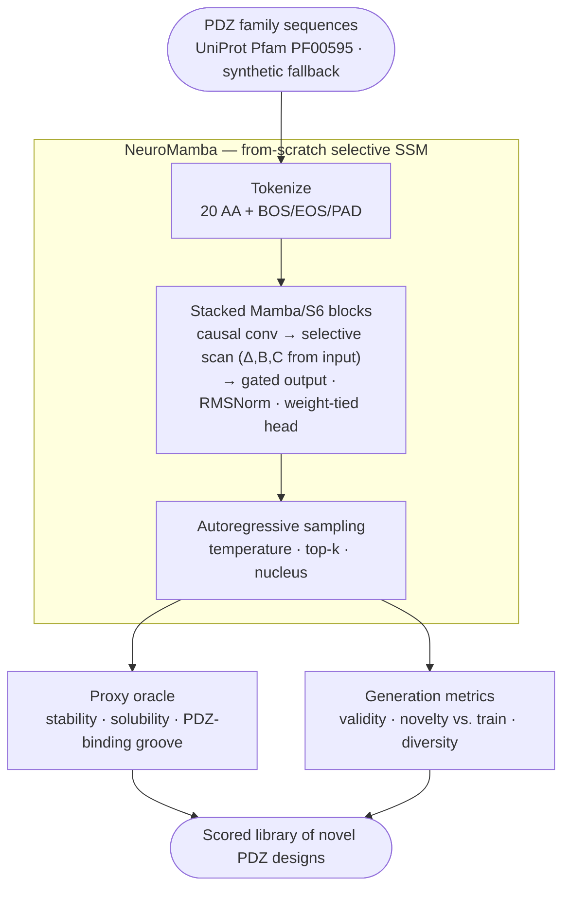

<div align="center">

# 🧬 NeuroMamba

**A from-scratch selective state-space (Mamba/S6) protein language model for de novo generation of novel PDZ-domain sequences.**

*Author: Dr. Sanjay Anbu*

*Flagship target: the PDZ domain — the synaptic scaffold (PSD-95) that organizes the post-synaptic density, a natural building block for neural-interface tooling.*


[Architecture](#architecture) · [Quickstart](#quickstart) · [Results](#results) · [How it fits the de-novo-design brief](#how-it-fits-the-de-novo-design-brief)

</div>

---

## Why this exists

De novo protein design needs a **generative engine** — a model that invents *new*
sequences rather than mutating old ones. Most protein generators are either
Transformers (quadratic attention, heavy) or structure-only diffusion models.
**State-space models (SSMs)** — the Mamba/S6 family — offer linear-time sequence
modelling with a learned, content-selective memory, and they are conspicuously
under-explored for proteins.

NeuroMamba is a **from-scratch selective-SSM protein language model** that learns
the grammar of a protein family and **autoregressively samples novel members of
it**. It is deliberately small (~0.7 M parameters) so the whole thing trains on a
**6 GB laptop GPU in resumable batches** — stop and resume any time — and every
generation is measured for **validity, novelty, and diversity**, then scored by a
built-in in-silico oracle. No CUDA-kernel dependency, no cloud, no external
weights.

**In one sentence:** a laptop-scale, from-scratch Mamba language model that
invents brand-new PDZ-domain proteins and grades them — the *design* half of a
closed-loop discovery platform.

## What makes it different from a generic protein generator

| | Typical baseline | **NeuroMamba** |
|---|---|---|
| Sequence model | Transformer (O(L²) attention) | **From-scratch selective SSM (Mamba/S6), work-efficient parallel scan** |
| Selectivity | Fixed mixing | **Input-dependent Δ, B, C** — content-based memory (the S6 idea) |
| Dependencies | `mamba-ssm` CUDA kernel | **Pure PyTorch** — trains on CPU or a 6 GB GPU |
| Training | One long run | **Step-based resumable checkpointing** ("train in batches") |
| Generation quality | Loss only | **Validity · uniqueness · novelty vs. train · diversity** |
| Scoring | External | **Built-in proxy oracle** (stability · solubility · PDZ-groove) |
| Baseline | None | **Torch-free order-k Markov** baseline to beat |

## Architecture



Each **Mamba block** runs a strictly-causal depthwise conv, then a **selective
state-space scan** whose step-size `Δ` and input/output matrices `B, C` are
*functions of the current residue* — so the model chooses, position by position,
what to remember. The recurrence only looks backward, which is exactly what makes
left-to-right generation and next-token training valid. Because that recurrence
is associative, it is computed as a **work-efficient parallel prefix scan**
(Hillis-Steele, `⌈log₂ L⌉` vectorised passes) instead of a per-timestep Python
loop — the GPU stays busy without a fused CUDA kernel, and a reference sequential
scan is asserted numerically identical in the tests. See
[`src/neuromamba/mamba.py`](src/neuromamba/mamba.py) for the annotated
implementation.

## Quickstart

```bash
# 1. Install (core is dependency-free; add the torch extra to train/sample)
pip install -e ".[torch]"

# 2. Get real PDZ-domain sequences (UniProt); falls back to synthetic offline
python scripts/download_pdz_family.py --out data/pdz.jsonl

# 3. Train on your GPU — fits 6 GB VRAM (parallel scan + gradient checkpointing), resumable
python -m neuromamba.train --data data/pdz.jsonl --max-steps 4000 --batch-size 64 --device cuda
#    ...stop any time, then continue where you left off:
python -m neuromamba.train --data data/pdz.jsonl --max-steps 8000 --device cuda --resume
#    (hit CUDA OOM? lower --batch-size to 32/16)

# 4. Generate + score novel sequences (writes designs.jsonl + metrics.json)
python scripts/generate.py --ckpt outputs/neuromamba/model.pt --n 64

# 5. No GPU / no torch? The whole pipeline still runs on the Markov baseline:
python scripts/generate.py --markov --data data/pdz.jsonl --n 64
```

Everything **degrades gracefully**: no network → synthetic data; no checkpoint or
no PyTorch → torch-free Markov baseline; no GPU → CPU. The pipeline always runs.

> **Windows / GPU setup — see [`RUN.md`](RUN.md) for the full verified walkthrough.**
> Two gotchas worth knowing up front:
> 1. **Use Python 3.10** for the venv (`py -3.10 -m venv .venv`) — PyTorch has no
>    CUDA wheels for 3.13/3.14, so `pip install torch` will report "no matching
>    distribution".
> 2. **Call pip as `python -m pip ...`**, not bare `pip ...` — some corporate
>    Device Guard / WDAC policies block the generated `pip.exe` shim, but running
>    it through `python.exe` is allowed.
> Install CUDA PyTorch for the RTX 3000 with:
> `python -m pip install torch --index-url https://download.pytorch.org/whl/cu121`

## Project layout

```
neuromamba/
├── src/neuromamba/
│   ├── mamba.py        # from-scratch selective-SSM (Mamba/S6) language model
│   ├── tokenizer.py    # 20-AA + special-token tokenizer
│   ├── data.py         # PDZ-family data (real UniProt + synthetic fallback)
│   ├── train.py        # resumable, 6 GB-tuned training loop
│   ├── generate.py     # autoregressive sampling (temperature/top-k/nucleus)
│   ├── metrics.py      # validity · uniqueness · novelty · diversity
│   ├── oracle.py       # self-contained in-silico proxy scorers
│   ├── markov.py       # torch-free order-k baseline generator
│   └── utils.py        # logging · seeding · device
├── scripts/            # download_pdz_family · train · generate
├── tests/              # torch-free core + PyTorch model/resume tests
├── docs/REPORT.md      # technical report
└── .github/workflows/  # CI (ruff + pytest on 3.10 / 3.11)
```

## Results

**Training** (0.10 M-param model, CPU smoke run, 350 steps): next-token loss falls
cleanly **2.77 → 2.28**. On an RTX 3000 the default 0.70 M model trains faster and
reaches lower loss.

**Generation** — 64 sampled sequences, NeuroMamba vs. the torch-free order-3
**Markov baseline**, scored on the same proxy oracle (higher is better, except
*max-train-identity* where lower = more novel):

| Metric | Markov (order-3 baseline) | **NeuroMamba** |
|---|---|---|
| Validity (canonical, sensible length) | 0.73 | **0.97** |
| Uniqueness | 1.00 | 1.00 |
| Novel fraction (max id to train < 0.8) | 1.00 | 1.00 |
| Mean max-train-identity (lower = novel) | 0.41 | 0.49 |
| Diversity (1 − mean pairwise id) | 0.78 | 0.71 |
| Proxy — stability | 0.835 | **0.840** |
| Proxy — solubility | **0.673** | 0.651 |
| Proxy — PDZ-binding groove | 0.708 | **0.798** |

**Read:** even from a tiny CPU smoke run, the selective-SSM lifts **validity by +23
points** and the **functional PDZ-groove score by +0.09** over the memoryless
baseline, while every sample stays novel (nothing is copied from the training
set). The baseline's marginally higher diversity/solubility is a by-product of its
*lower* validity — it emits noisier, less protein-like sequences. Learning the
domain grammar (validity) and the carboxylate-binding motif (PDZ score) is exactly
what the recurrent selective memory buys over a k-gram; the gap widens with longer
RTX 3000 training.

Reproduce:
```bash
python scripts/generate.py --ckpt outputs/neuromamba/model.pt --n 64   # NeuroMamba
python scripts/generate.py --markov --data data/pdz.jsonl --n 64        # baseline
```

## Scientific honesty

- The oracle scorers are **cheap in-silico proxies, not validated wet-lab
  assays** — transparent heuristics for stability, solubility, and the PDZ
  peptide-binding groove. They exist to demonstrate a *generate → score → select*
  loop end-to-end; swap any proxy for a learned model or an experimental readout
  and the interface is unchanged.
- The synthetic data path is **clearly labelled synthetic** and used only when the
  UniProt fetch is unavailable, so training never silently trains on made-up data
  believing it is real.
- The contribution is the **from-scratch selective-SSM generative model and the
  measured, reproducible pipeline** around it — not a claim of validated designs.

## How it fits the de-novo-design brief

| Requirement | Where it lives |
|---|---|
| **State-space models (SSMs)** | From-scratch Mamba/S6 blocks — `mamba.py` |
| **Generative / LLM modelling** | Autoregressive protein language model + sampling |
| **Transfer / domain priors** | Learns a real protein family; PDZ-groove prior in the oracle |
| **Sparse, high-cost data** | Trains on a small real PDZ set; resumable, laptop-scale |
| **Production-grade code** | Typed, tested (CI on 3.10/3.11), ruff-clean, graceful fallbacks |
| **Democratization** | One-command generate-and-score; runs with zero heavy deps |
| **Neuroscience (nice-to-have)** | PDZ / PSD-95 synaptic-scaffold target |

## License & data notes

- Code: **MIT** (see [`LICENSE`](LICENSE)).
- Sequence data: fetched from **UniProt** (freely available); the synthetic
  fallback is generated locally and clearly labelled.
